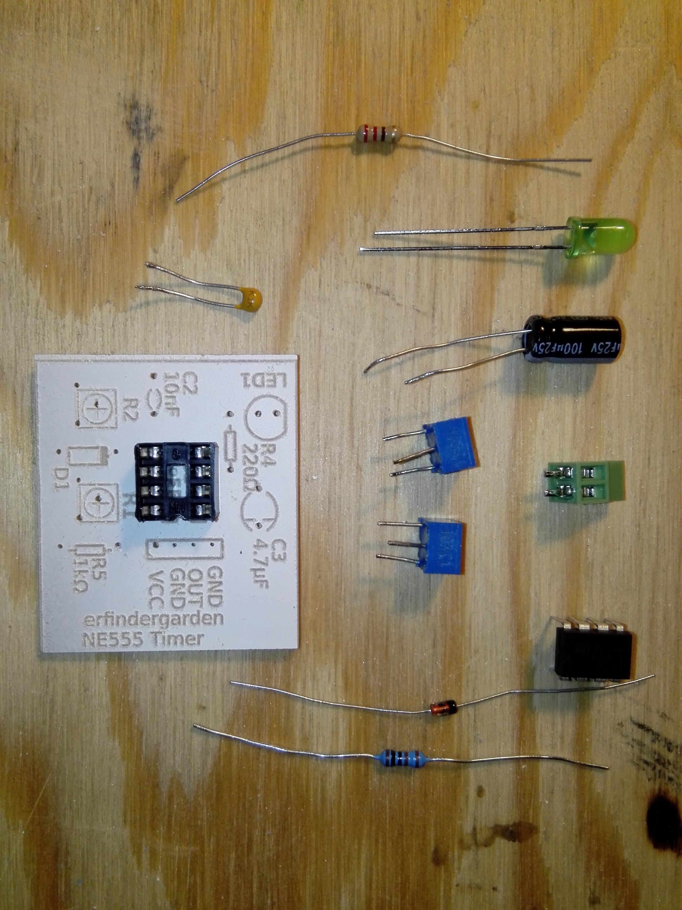
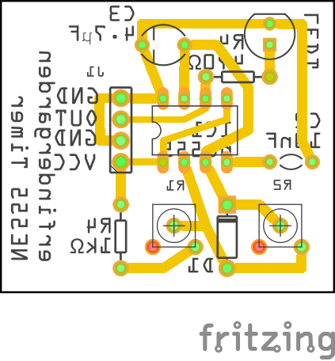
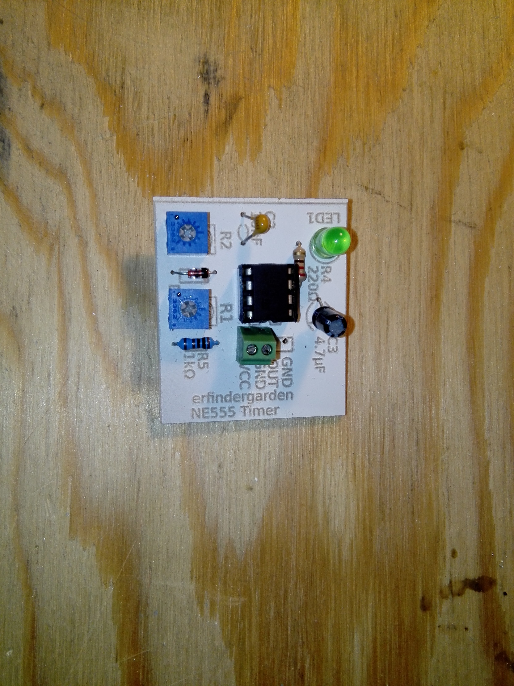

# NE555 PCB 

<body bgcolor="FFFFFA">

Kleines Lötkit für den www.erfindergarden.de.

Die benötigten Bauteile bekommt man alle im erfindergarden. 

Die Platine kann ebenfalls im erfindergarden mit der othermill gefräst werden.

Die Impuls- und Periodendauer des Timers kann durch Kombination von verschiedenen Potentiometern, Widerständen und Kondensatoren beliebig verändert werden. Eine Berechnung gibt es hier: [elektronik-kompendium](https://www.elektronik-kompendium.de/sites/slt/0310131.htm)

Das fertige Board sieht dann so aus:

Umfangreiches Infomaterial zum NE555 gibt es im Netz, z. B. hier im [elektronik-kompendium](https://www.elektronik-kompendium.de/sites/bau/0206115.htm)
